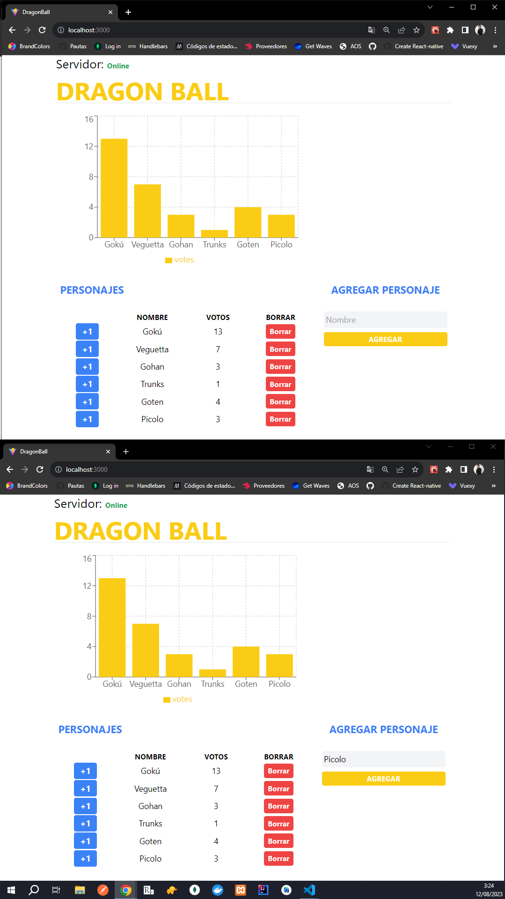

# Dragon Ball - Socket io



Este proyecto es una aplicación web desarrollada utilizando Node.js con TypeScript, Express.js, React.js con TypeScript y Socket io. La aplicación permite a los usuarios crear personajes, votar por ellos y ver las acciones reflejadas en tiempo real en una gráfica utilizando la librería Recharts.

#### Cliente
  

#### Servidor
   


## Instrucciones

1. Clona este repositorio en tu máquina local.
2. Navega a la carpeta `server` y ejecuta 
```bash 
npm i && npm run dev
```
2. Navega a la carpeta `client` y ejecuta 
```bash 
npm i && npm run dev
```
5. Abre tu navegador y accede a `http://localhost:3000` para comenzar a utilizar la aplicación.


